# AWS ECS Fargate Deployment Guide

AWS Elastic Container Service (ECS) with Fargate offers a serverless container environment. By deploying to ECS, you can bypass the NodeJS codebase API Gateway proxy for microservices routing, leveraging an **Application Load Balancer (ALB) Path-Based Listener** instead.

---

## 1. Network Topology with ALB Path Routing

Instead of routing all frontend requests to a single Express gateway proxy, you configure a public-facing Application Load Balancer (ALB). The ALB routes requests directly to target groups mapping to individual ECS service endpoints.

```mermaid
graph TD
    Client[Browser / Frontend App] -->|HTTPS Port 443| ALB[Application Load Balancer]
    
    ALB -->|/api/auth/*| TG-Gateway[Target Group: Gateway Port 5005]
    ALB -->|/api/users/*| TG-Gateway
    ALB -->|/api/notifications/*| TG-Gateway
    
    ALB -->|/api/academics/*| TG-Academic[Target Group: Academic Port 8081]
    ALB -->|/api/schedule/*| TG-Schedule[Target Group: Schedule Port 8082]
    ALB -->|/api/library/*| TG-Library[Target Group: Library Port 8083]
    ALB -->|/api/finance/*| TG-Finance[Target Group: Finance Port 8084]
    ALB -->|/api/inventory/*| TG-Inventory[Target Group: Inventory Port 8085]
    ALB -->|/api/cafe/*| TG-Cafe[Target Group: Cafe Port 8086]
    
    ALB -->|/api/assignments/*| TG-Quiz[Target Group: Quiz Port 8001]
    ALB -->|/api/quizzes/*| TG-Quiz
    
    ALB -->|/api/research/*| TG-Research[Target Group: Research Port 8002]
    ALB -->|/api/labs/*| TG-Research
    
    ALB -->|/api/parking/*| TG-Parking[Target Group: Parking Port 8003]
    ALB -->|/api/alumni/*| TG-Parking
    
    ALB -->|/api/reports/*| TG-Report[Target Group: Report Port 8004]
    
    ALB -->|/api/devops/*| TG-Gateway
    
    TG-Gateway --> ECS-Gateway[ECS Task: gateway-service]
    TG-Academic --> ECS-Academic[ECS Task: academic-service]
    TG-Schedule --> ECS-Schedule[ECS Task: scheduling-service]
    TG-Library --> ECS-Library[ECS Task: library-service]
    TG-Finance --> ECS-Finance[ECS Task: finance-service]
    TG-Inventory --> ECS-Inventory[ECS Task: inventory-service]
    TG-Cafe --> ECS-Cafe[ECS Task: cafe-service]
    TG-Quiz --> ECS-Quiz[ECS Task: assignment-quiz-service]
    TG-Research --> ECS-Research[ECS Task: research-lab-service]
    TG-Parking --> ECS-Parking[ECS Task: parking-alumni-service]
    TG-Report --> ECS-Report[ECS Task: report-service]
```



### 1.1 Setting up ALB Rules
For each microservice, create an ECS Service and associate it with a unique **Target Group**.
Then, add rules to the ALB HTTPS Listener (Port 443):
1.  **Rule 1**: Path is `/api/academics/*` -> Forward to Target Group `tg-academic-service` (Health Check Path: `/health`).
2.  **Rule 2**: Path is `/api/schedule/*` -> Forward to Target Group `tg-scheduling-service` (Health Check Path: `/health`).
3.  **Rule 3**: Path is `/api/library/*` -> Forward to Target Group `tg-library-service` (Health Check Path: `/health`).
4.  **Rule 4**: Path is `/api/finance/*` -> Forward to Target Group `tg-finance-service` (Health Check Path: `/health`).
5.  **Rule 5**: Path is `/api/inventory/*` -> Forward to Target Group `tg-inventory-service` (Health Check Path: `/health`).
6.  **Rule 6**: Path is `/api/cafe/*` -> Forward to Target Group `tg-cafe-service` (Health Check Path: `/health`).
7.  **Rule 7**: Path is `/api/assignments/*` or `/api/quizzes/*` -> Forward to Target Group `tg-assignment-quiz-service` (Health Check Path: `/health`).
8.  **Rule 8**: Path is `/api/research/*` or `/api/labs/*` -> Forward to Target Group `tg-research-lab-service` (Health Check Path: `/health`).
9.  **Rule 9**: Path is `/api/parking/*` or `/api/alumni/*` -> Forward to Target Group `tg-parking-alumni-service` (Health Check Path: `/health`).
10. **Rule 10**: Path is `/api/reports/*` -> Forward to Target Group `tg-report-service` (Health Check Path: `/health`).
11. **Rule 11**: Path is `/api/auth/*`, `/api/users/*`, `/api/notifications/*` or `/api/devops/*` -> Forward to Target Group `tg-gateway-service` (Health Check Path: `/health`).
12. **Default Rule**: Path is `*` (any other traffic) -> Forward to static frontend storage (Amazon S3 / CloudFront) or a Target Group serving the frontends.

---

## 2. ECS Task Definitions & Secrets Management

Use AWS Secrets Manager to inject environment configurations into the task container definitions securely.

### 2.1 Sample Task Definition JSON (e.g. academic-service)
Create a file `task-academic-service.json` and deploy it using AWS CLI or Terraform:
```json
{
  "family": "asst-academic-service",
  "networkMode": "awsvpc",
  "requiresCompatibilities": [
    "FARGATE"
  ],
  "cpu": "256",
  "memory": "512",
  "executionRoleArn": "arn:aws:iam::123456789012:role/ecsTaskExecutionRole",
  "taskRoleArn": "arn:aws:iam::123456789012:role/ecsTaskRole",
  "containerDefinitions": [
    {
      "name": "academic-service",
      "image": "123456789012.dkr.ecr.us-east-1.amazonaws.com/asst-academic-service:latest",
      "portMappings": [
        {
          "containerPort": 8081,
          "hostPort": 8081,
          "protocol": "tcp"
        }
      ],
      "essential": true,
      "environment": [
        {
          "name": "PORT",
          "value": "8081"
        }
      ],
      "secrets": [
        {
          "name": "DATABASE_URL",
          "valueFrom": "arn:aws:secretsmanager:us-east-1:123456789012:secret:asst/production/env-abc123:DATABASE_URL_ACADEMIC::"
        }
      ],
      "logConfiguration": {
        "logDriver": "awslogs",
        "options": {
          "awslogs-group": "/ecs/asst-academic-service",
          "awslogs-region": "us-east-1",
          "awslogs-stream-prefix": "ecs"
        }
      }
    }
  ]
}
```

### 2.2 Task Definition for Gateway Service (Handling optional S3 Uploads)
Since the gateway task uploads avatars directly to S3 if configured, ensure its task definition includes the S3 configurations and links to the S3 bucket access policy:
```json
{
  "name": "gateway-service",
  "image": "123456789012.dkr.ecr.us-east-1.amazonaws.com/asst-gateway-service:latest",
  "portMappings": [
    {
      "containerPort": 5005,
      "hostPort": 5005,
      "protocol": "tcp"
    }
  ],
  "secrets": [
    {
      "name": "DATABASE_URL",
      "valueFrom": "arn:aws:secretsmanager:us-east-1:123456789012:secret:asst/production/env-abc123:DATABASE_URL_AUTH::"
    },
    {
      "name": "JWT_SECRET",
      "valueFrom": "arn:aws:secretsmanager:us-east-1:123456789012:secret:asst/production/env-abc123:JWT_SECRET::"
    },
    {
      "name": "AWS_S3_BUCKET",
      "valueFrom": "arn:aws:secretsmanager:us-east-1:123456789012:secret:asst/production/env-abc123:AWS_S3_BUCKET::"
    },
    {
      "name": "AWS_REGION",
      "valueFrom": "arn:aws:secretsmanager:us-east-1:123456789012:secret:asst/production/env-abc123:AWS_REGION::"
    }
  ]
}
```
*Note: We do not pass `AWS_ACCESS_KEY_ID` or `AWS_SECRET_ACCESS_KEY`! The container will automatically inherit permissions to put/get objects on the S3 bucket through the `taskRoleArn` attached to the task definition.*

---

## 3. Frontend Deployment (Admin, Campus, and DevOps portals)
Instead of running node servers inside ECS to serve static web assets, compile the frontends locally or via CI/CD and upload them to **Amazon S3**:
1.  Run `npm run build` on `admin-portal`, `user-portal`, and `devops-dashboard`.
2.  Create three S3 buckets:
    *   `asst-admin-portal-static`
    *   `asst-campus-portal-static`
    *   `asst-devops-portal-static`
3.  Upload the contents of each `/dist` directory to the respective bucket.
4.  Configure an **Amazon CloudFront Distribution** pointing to each bucket.
5.  Point your DNS (Route 53) to the CloudFront domain endpoints (e.g. `admin.asst.edu`, `campus.asst.edu`, `devops.asst.edu`).
